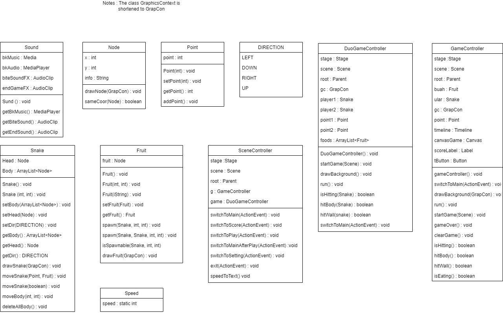

# SNAKE GAME 

This repository is a final project (Java GUI) from Object-Oriented Programming Class, Teknik Informatika Universitas Padjadjaran. 

[Challenge Guidelines](challenge-guideline.md)

Snake Game is a very simple game where the player controls a snake. The goal of the game is to get as many points as possible by 'eating' the food that is spawned in the map of the game. Everytime the snake eat a food, it becomes longer! But, the player needs to be careful, because if the snake hits itself, it dies! (or in some versions, this also applies when he hits the wall of the map)

## Credits
| NPM           | Name        |
| ------------- |-------------|
| 140810210015  | Amir Salim    |
| 140810210029  | Rifqi Muhadzib Ahdan    |
| 140810210041  | Muhammad Fauzan Azhiima |

## Change log
- **[Sprint Planning](changelog/sprint-planning.md) - (20 November 2022)** 
   -  Mendiskusikan Apa saja yang akan ada di projek
   

- **[Sprint 1](changelog/sprint-1.md) - (date from 20 November 2022 until 21 November 2022)** 
   - Inisiasi Gradle 

- **[Sprint 2](changelog/sprint-2.md) - (date from 22 November 2022 until 28 November 2022)** 
   - Membuat logika untuk snake
   - Membuat logika untuk fruit
   - Membuat hit detection untuk snake
   - Menambahkan sistem poin
   - Membuat link antara jhrame (menu -> game, menu -> leaderboard, menu -> exit)
   
- **[Sprint 3](changelog/sprint-3.md) - (date from x until x)** 
   - Add Multiplayer mode
   - Add background music and sound effect
   - Add gameover screen
   - Add Settings
   - Improve drawing logic
   - Improve UI

## Running The App

File utama : App.java
1. Masuk ke dalam direktori Snake
2. Build project dengan command `gradle build`
3. Control yang digunakan dalam permainan adalah WASD untuk player satu dan IJKL untuk player dua (di mode multiplayer)

## Classes Used

## Notable Assumption and Design App Details

- 
